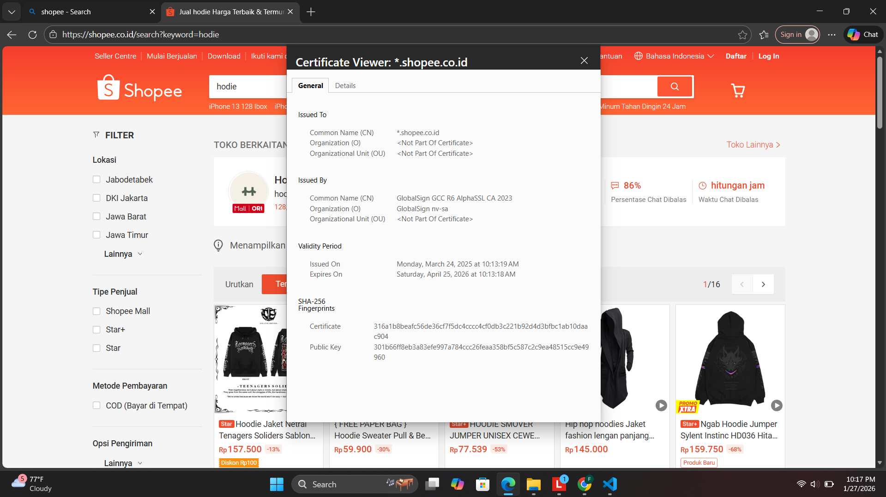

# Laporan Praktikum Kriptografi
Minggu ke-: 12 
Topik: [Aplikasi TLS & E-commerce  ]  
Nama: [Faiz Al Mubarok]  
NIM: [230202748]  
Kelas: [5IKRB]  

---

## 1. Tujuan
Menganalisis penggunaan kriptografi pada **email** dan **SSL/TLS**.
Menjelaskan enkripsi dalam transaksi **e-commerce**.
Mengevaluasi isu **etika & privasi** dalam penggunaan kriptografi di kehidupan sehari-hari. 

---

## 2. Dasar Teori
Kriptografi merupakan ilmu yang mempelajari teknik pengamanan informasi dengan cara mengubah pesan asli (plaintext) menjadi pesan tersandi (ciphertext) agar tidak dapat dibaca oleh pihak yang tidak berwenang. Salah satu bentuk kriptografi awal adalah cipher klasik, yang menggunakan teknik sederhana seperti substitusi dan pergeseran karakter. Contoh cipher klasik yang paling dikenal adalah Caesar Cipher, yaitu metode enkripsi yang mengganti setiap huruf pada plaintext dengan huruf lain yang posisinya digeser sejauh nilai tertentu dalam alfabet berdasarkan sebuah kunci.
Caesar Cipher bekerja menggunakan konsep aritmetika modular, khususnya modulo 26 yang merepresentasikan jumlah huruf alfabet. Setiap huruf dikonversi ke nilai numerik, kemudian dilakukan operasi pergeseran dengan rumus enkripsi E(x) = (x + k) mod 26 dan dekripsi D(x) = (x - k) mod 26, di mana x adalah nilai huruf dan k adalah kunci. Walaupun Caesar Cipher tidak lagi digunakan untuk pengamanan data modern karena tingkat keamanannya rendah, algoritma ini sangat berguna sebagai media pembelajaran untuk memahami konsep dasar enkripsi, dekripsi, dan penggunaan kunci dalam kriptografi.


---

## 3. Alat dan Bahan
1. Python 
2. Visual Studio Code (VS Code) atau editor teks lain
3. Git dan akun GitHub
4. Sistem operasi Windows / Linux / macOS

Tidak digunakan library tambahan karena program dibuat menggunakan fitur standar Python.

---

## 4. Langkah Percobaan
Membuat folder praktikum/week2-cryptosystem/src/.
1. Membuat file Python dengan nama caesar_cipher.py.
2. Menuliskan kode program Caesar Cipher pada file tersebut.
3. Menyimpan file yang telah dibuat.
4. Membuka terminal atau command prompt.
5. Masuk ke direktori tempat file disimpan.
6. Menjalankan program dengan perintah:python caesar_cipher.py
7. Memasukkan teks dan kunci sesuai permintaan program.
8. Mengamati hasil enkripsi dan dekripsi.

---

## 5. Source Code
Pada pratikum week ke 12 tidak menggunakan source code.

---

## 6. Hasil dan Pembahasan
(- Lampirkan screenshot hasil eksekusi program (taruh di folder `screenshots/`).  
- Berikan tabel atau ringkasan hasil uji jika diperlukan.  
- Jelaskan apakah hasil sesuai ekspektasi.  
- Bahas error (jika ada) dan solusinya. 

Hasil eksekusi program Caesar Cipher:



Langkah 1-Analisis SSL/TLS pada Email & Web
SSL/TLS merupakan protokol keamanan yang berfungsi mengenkripsi data, menjaga integritas informasi, serta melakukan autentikasi server agar komunikasi antara pengguna dan server tetap aman, dan berdasarkan sertifikat yang ditampilkan pada domain *.shopee.co.id, terlihat bahwa Shopee menggunakan sertifikat wildcard yang berlaku untuk seluruh subdomain, diterbitkan oleh Certificate Authority terpercaya yaitu GlobalSign, menggunakan algoritma hash SHA-256, serta memiliki masa berlaku yang masih aktif, sehingga dapat disimpulkan bahwa koneksi web Shopee telah dilindungi dengan standar keamanan tinggi; selain pada web, SSL/TLS juga digunakan pada sistem email melalui protokol seperti SMTPS, IMAPS, POP3S, dan STARTTLS untuk melindungi pengiriman email konfirmasi, reset password, serta notifikasi agar tidak dapat disadap pihak lain, sehingga keamanan komunikasi digital tetap terjaga.

Langkah 2-Studi Kasus SSL/TLS pada E-Commerce
Dalam konteks e-commerce seperti Shopee, SSL/TLS berperan penting saat pengguna melakukan login, memilih produk, hingga melakukan pembayaran, karena seluruh data sensitif seperti username, password, alamat, nomor telepon, serta informasi transaksi dienkripsi sebelum dikirim ke server sehingga tidak dapat dibaca oleh pihak yang tidak berwenang, dan apabila SSL/TLS tidak diterapkan maka risiko seperti pencurian akun, manipulasi data transaksi, hingga penyalahgunaan informasi pribadi sangat mungkin terjadi, sehingga penerapan SSL/TLS tidak hanya meningkatkan keamanan teknis tetapi juga kepercayaan pengguna terhadap platform.

Langkah 3-Analisis Etika & Privasi
Dari sudut pandang etika dan privasi, penggunaan SSL/TLS mencerminkan tanggung jawab platform dalam menjaga kerahasiaan dan keamanan data pengguna, karena perusahaan memiliki kewajiban moral dan hukum untuk melindungi informasi pribadi seperti identitas, kontak, serta riwayat transaksi dari kebocoran maupun penyalahgunaan, dan dengan menerapkan enkripsi, autentikasi server, serta kebijakan keamanan yang jelas, platform e-commerce menunjukkan komitmen terhadap prinsip transparansi, perlindungan data, serta penghormatan terhadap hak privasi pengguna.

---

## 7. Jawaban Pertanyaan
(Jawab pertanyaan diskusi yang diberikan pada modul.  
- Pertanyaan 1: Apa fungsi kunci pada Caesar Cipher?
               Kunci berfungsi menentukan jumlah pergeseran huruf pada proses enkripsi dan dekripsi. Semakin besar kunci, semakin besar pergeseran karakter. 
- Pertanyaan 2: Mengapa Caesar Cipher tidak aman untuk komunikasi modern?
                Karena hanya memiliki 25 kemungkinan kunci sehingga mudah dipecahkan menggunakan brute force atau analisis frekuensi.
)
---

## 8. Kesimpulan
(Berdasarkan percobaan, algoritma Caesar Cipher berhasil melakukan proses enkripsi dan dekripsi dengan baik. Praktikum ini membantu memahami konsep dasar kriptografi, khususnya hubungan antara plaintext, ciphertext, dan kunci.)

---

## 9. Daftar Pustaka
(Cantumkan referensi yang digunakan.    
- atz, J., & Lindell, Y. (2014). Introduction to Modern Cryptography. CRC Press.*.  
- Stallings, W. (2017). Cryptography and Network Security: Principles and Practice. Pearson.*.  )

---

## 10. Commit Log
(Tuliskan bukti commit Git yang relevan.  
```
commit a1b2c3d
Author: Faiz Al Mubarok [huahuh3@gmail.com]
Date: 2026-01-27
Message: week12-cryptosystem


    week12-cryptosystem: implementasi Caesar Cipher dan laporan )
```
