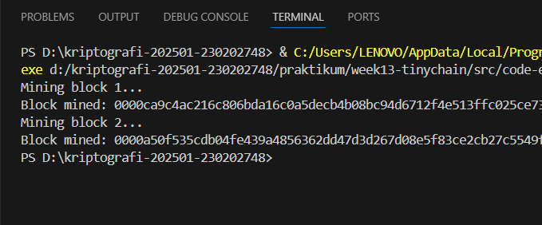

# Laporan Praktikum Kriptografi
Minggu ke-: 13 
Topik: [TinyChain – Proof of Work (PoW)]  
Nama: [Faiz Al Mubarok]  
NIM: [230202748]  
Kelas: [5IKRB]  

---

## 1. Tujuan
- Menjelaskan peran hash function dalam blockchain.
- Melakukan simulasi sederhana Proof of Work (PoW).
- Menganalisis keamanan cryptocurrency berbasis kriptografi.

---

## 2. Dasar Teori
(Blockchain merupakan teknologi buku besar terdistribusi yang menyimpan data dalam bentuk rangkaian blok yang saling terhubung menggunakan fungsi hash kriptografi, di mana setiap blok berisi data, hash blok sebelumnya, serta hash blok itu sendiri sehingga membentuk struktur yang sulit diubah, sementara hash function adalah algoritma kriptografi yang mengubah data dengan panjang bebas menjadi nilai tetap dan bersifat satu arah, sensitif terhadap perubahan kecil, serta sulit untuk dipalsukan, sedangkan Proof of Work (PoW) adalah mekanisme konsensus yang mengharuskan penambang (miner) menyelesaikan permasalahan komputasi berupa pencarian nilai nonce agar hash blok memenuhi tingkat kesulitan tertentu, sehingga proses penambahan blok membutuhkan usaha komputasi yang signifikan dan membuat manipulasi data menjadi sangat mahal, yang pada akhirnya menjadikan blockchain lebih aman, transparan, dan tahan terhadap serangan.  )

---

## 3. Alat dan Bahan
(- Python 3.x  
- Visual Studio Code / editor lain  
- Git dan akun GitHub  
- Library tambahan (misalnya pycryptodome, jika diperlukan)  )

---

## 4. Langkah Percobaan
(Tuliskan langkah yang dilakukan sesuai instruksi.  
Contoh format:
1. Membuat file `caesar_cipher.py` di folder `praktikum/week2-cryptosystem/src/`.
2. Menyalin kode program dari panduan praktikum.
3. Menjalankan program dengan perintah `python caesar_cipher.py`.)

---

## 5. Source Code
(Salin kode program utama yang dibuat atau dimodifikasi.  
Gunakan blok kode:
import hashlib
import time

class Block:
    def __init__(self, index, previous_hash, data, timestamp=None):
        self.index = index
        self.timestamp = timestamp or time.time()
        self.data = data
        self.previous_hash = previous_hash
        self.nonce = 0
        self.hash = self.calculate_hash()

    def calculate_hash(self):
        value = str(self.index) + str(self.timestamp) + str(self.data) + str(self.previous_hash) + str(self.nonce)
        return hashlib.sha256(value.encode()).hexdigest()

    def mine_block(self, difficulty):
        while self.hash[:difficulty] != "0" * difficulty:
            self.nonce += 1
            self.hash = self.calculate_hash()
        print(f"Block mined: {self.hash}")

class Blockchain:
    def __init__(self):
        self.chain = [self.create_genesis_block()]
        self.difficulty = 4

    def create_genesis_block(self):
        return Block(0, "0", "Genesis Block")

    def get_latest_block(self):
        return self.chain[-1]

    def add_block(self, new_block):
        new_block.previous_hash = self.get_latest_block().hash
        new_block.mine_block(self.difficulty)
        self.chain.append(new_block)

# Uji coba blockchain
my_chain = Blockchain()
print("Mining block 1...")
my_chain.add_block(Block(1, "", "Transaksi A → B: 10 Coin"))

print("Mining block 2...")
my_chain.add_block(Block(2, "", "Transaksi B → C: 5 Coin"))

```python
# contoh potongan kode
def encrypt(text, key):
    return ...
```
)

---

## 6. Hasil dan Pembahasan
(- Lampirkan screenshot hasil eksekusi program (taruh di folder `screenshots/`).  
- Berikan tabel atau ringkasan hasil uji jika diperlukan.  
- Jelaskan apakah hasil sesuai ekspektasi.  
- Bahas error (jika ada) dan solusinya. 

Hasil eksekusi program Caesar Cipher:



)

---

## 7. Jawaban Pertanyaan
(Jawab pertanyaan diskusi yang diberikan pada modul.  
- Pertanyaan 1: Mengapa fungsi hash sangat penting dalam blockchain?
                Fungsi hash penting karena digunakan untuk mengamankan data dalam setiap blok dan menghubungkan satu blok dengan blok lainnya, sehingga jika ada perubahan data maka nilai hash akan berubah dan manipulasi dapat langsung terdeteksi.
- Pertanyaan 2: Bagaimana Proof of Work mencegah double spending?
                Proof of Work mencegah double spending dengan memastikan setiap transaksi harus melalui proses mining yang sulit, sehingga seseorang tidak bisa dengan mudah menggandakan transaksi tanpa menguasai sebagian besar kekuatan komputasi jaringan.
- Pertanyaan 3: Apa kelemahan dari PoW dalam hal efisiensi energi?
                PoW membutuhkan daya listrik yang besar karena komputer harus melakukan banyak perhitungan berulang, sehingga boros energi dan biaya.
)
---

## 8. Kesimpulan
(Berdasarkan praktikum yang telah dilakukan, dapat disimpulkan bahwa fungsi hash dan Proof of Work memiliki peran penting dalam menjaga keamanan blockchain, di mana hash berfungsi memastikan integritas data dan PoW memastikan validasi transaksi dilakukan secara sah, namun di sisi lain mekanisme PoW memiliki kelemahan berupa konsumsi energi yang tinggi sehingga diperlukan pertimbangan penggunaan metode konsensus yang lebih efisien di masa depan.  )

---

## 9. Daftar Pustaka
(Cantumkan referensi yang digunakan.  
  
- Stallings, W. (2017). Cryptography and Network Security: Principles and Practice (7th Edition). Pearson Education.*.  
- Stinson, D. R., & Paterson, M. B. (2019). Cryptography: Theory and Practice (4th Edition). CRC Press.*.  )

---

## 10. Commit Log
(Tuliskan bukti commit Git yang relevan.  

```
commit week13-tinychain
Author: Faiz Al Mubarok <huahuh3@gmail.com>
Date:   2026-01-28

    week13-cryptosystem: TinyChain – Proof of Work (PoW) )
```
